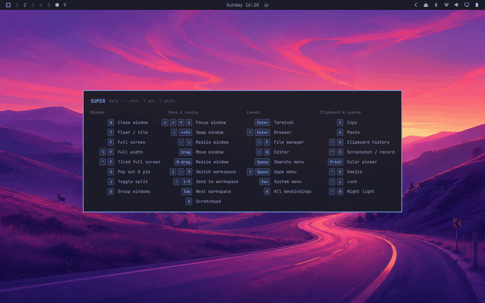

# Omarchy cheat sheet

Hold **SUPER** and a keybinding cheat sheet fades in. Let go and it's gone.



The sheet is generated from your live bindings, not from a list someone typed
out. Rebind a key and the chip follows it; unbind one and its row disappears.
SUPER itself never gets a chip — you're holding it — so only the `⌃ ⌥ ⇧`
extras are drawn.

## Requirements

- Omarchy 4 (Quickshell-based `omarchy-shell`)
- Hyprland 0.56.2 or newer

## Install

```bash
omarchy plugin add https://github.com/<you>/omarchy-cheatsheet.git
omarchy plugin enable alexw.cheatsheet
omarchy restart shell
```

Then add the two bindings to `~/.config/hypr/bindings.lua`. The plugin cannot
install these for you, and without them nothing will appear:

```lua
o.bind("SUPER_L", "Cheat sheet (hold SUPER)", hl.dsp.global("cheatsheet:hold"), { non_consuming = true })
o.bind("SUPER + SUPER_L", "Cheat sheet dismiss", hl.dsp.global("cheatsheet:unhold"), { release = true, non_consuming = true })
```

Reload with `hyprctl reload`, then hold SUPER.

## Why the bindings look like that

Each flag in those two lines is load-bearing, and all of it was measured
against Hyprland 0.56.2 rather than assumed:

- **`non_consuming` on the press bind.** Without it the bind swallows SUPER and
  it stops working as a modifier — the sheet would advertise chords it had just
  broken.
- **The release bind must carry the SUPER modmask** (`SUPER + SUPER_L`). Wired
  as a bare key with no modmask, a release bind never fires at all.
- **`global`, not `exec`.** Every chord you type starts with SUPER, so an exec
  bind here would spawn two processes (~55 ms) on every single shortcut. The
  `global` dispatcher hands the event straight to the already-running shell over
  `hyprland-global-shortcuts`, with no process at all.
- **Two shortcuts, not one.** `global` delivers one edge per bind: the press
  bind raises `hold.pressed` and never `released`, so dismissal needs its own
  shortcut, which arrives as `unhold.released`.

## Behaviour

- **Tap-proof.** The sheet only appears after SUPER has been held for 200 ms, so
  ordinary chords like `SUPER+W` never flash it.
- **Never takes the keyboard.** The layer surface is `WlrKeyboardFocus.None`
  with an empty input region, so it cannot eat the chord it is advertising and
  clicks fall through to the windows underneath.
- **Self-closing.** Hyprland suppresses the release bind once a chord has fired
  during the same hold, which would leave the sheet stranded on screen. Two
  backstops cover it: dismissal on real compositor activity (window, workspace,
  float, group and monitor events) and a hard cap.

## Configuration

Knobs live at the top of `Cheatsheet.qml`:

| Property | Default | What it does |
|---|---|---|
| `revealDelay` | `200` | ms SUPER must be held before the sheet appears |
| `maxVisibleMs` | `6000` | hard cap, for the suppressed-release case |
| `chipsWidth` | `Style.space(62)` | width of the keycap column |
| `columnGap` | `Style.space(22)` | space between sections |

Which bindings appear, and how they're grouped, is the `SECTIONS` table in
`CheatsheetModel.js`. Each row is either a `desc` that's looked up in your live
bindings, or a hand-drawn `keys` summary that collapses a family (the arrow
keys, workspaces 1–9) into one line and names a `requires` description so it
disappears if you unbind that family.

Saving a change needs `omarchy restart shell`: the plugin is `keepLoaded`, and
Omarchy's hot-reload does not replace a kept instance.

## Known limitations

- **Workspace rows are hand-labelled.** Hyprland reports Lua `code:NN` bindings
  with an empty `key` *and* `keycode: 0`, so there is nothing to resolve. The
  `1–9` chips are drawn from the curation table instead of from your bindings.
- **Chords that run a command don't self-dismiss.** The activity backstop sees
  window and workspace events, but something like `SUPER+C` emits nothing, so
  the sheet waits for the cap.
- **Multi-monitor is untested.** The overlay follows `Hyprland.focusedMonitor`,
  but it has only ever run on a single-output machine.

## Licence

TBD
